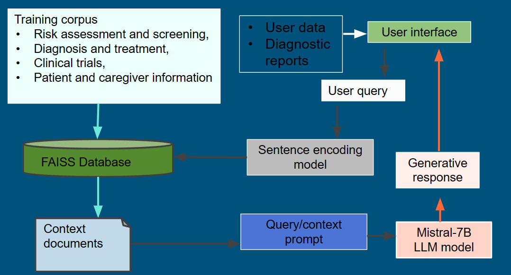

# Oncointerpreter.ai enables interactive, personalized summarization of cancer diagnostics data

Emerging applications of artificial generative intelligence are addressing crucial needs for rapid
processing, interpretation and summarization of complex biomedical data. We develop
Oncointerpreter.ai built on the Mistral-7B and Llama-2 7B large language models trained on a local,
curated corpus to offer personalized summarization of clinical cancer genomic and pathological data in
real time via a graphical interface.


### How to Run

To get Oncointerpreter.ai up and running on your local machine, follow these simple steps:

```bash
python3 page.py
```
**You must have CUDA configured on your machine to run this application**


### Libraries Needed

All the libraries needed for the application can simply be install via requirements.txt

```bash
pip install -r requirements.txt
```


### Description of the Files

- **llama2.py**: Contains the code for the Llama2 portion, integrating Llama2 models to enhance the analytical capabilities of the application.
- **mistral.py**: Houses the Mistral-7B model implementation, contributing to the application's ability to understand and interpret complex medical texts.
- **gpt-neo.py**: Incorporates the GPT-Neo model, adding to the app's depth in generating human-like text and responses.
- **page.py**: The main UI of the app. This script initializes and runs the web interface, serving as the primary point of interaction for users.


### Overview of Architecture


